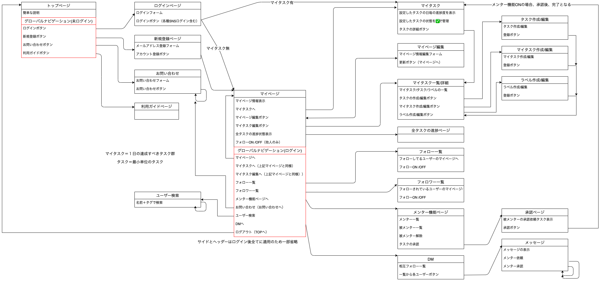

# README

## 「Tasrop」  
 Task for road to becoming professinal
<!-- リンク貼り付け予定 -->
  <br>
<!--    -->
  
## 概要
ターゲットは、プロフェッショナル性を求められるこの現代において <br>
「達成するべき本質を見失っている方」、「自分の努力を形に残していきたい方」、「自分の努力を人と共有したい方」 <br>
 <br>
あなたにとって、プロとは何を示すものでしょうか？ <br>
〇〇ができる、〇〇の資格を保持している、〇〇専門の訓練を受けた、などなど <br>
人それぞれに、定義があると思います。 <br>
各自が定めたルールで、その人がプロかどうかを測っているのです。 <br>

ここまでやったらプロ、そう示してくれる何かもあるとは思います。 <br>
しかし、他人の定めたルールなんて曖昧なものを指標にすることを繰り返していたら <br>
いつしか自分を見失ってしまうのではないでしょうか？ <br>
 <br>
一つの指標があります。 <br>
ある事象に、１００００時間を費やした者は一定の理解を得ている可能が極めて高い。 <br>
自他ともに、わかやすい指標だと私は確信しています。 <br>
 <br>
故に、あなたのやってきたことを、Tasropアプリを使い <br>
目に見える時間として残していきませんか？？ <br>
誰がなんと言おうと、積み上げた時間が、あなたをプロとして認めてくれるでしょう。 <br>

## できること
自分のやるべきことを設定し、やってきたことを公開することができます  
- **マイタスク作成**  
  ・最小単位でタスクを作成し、そのタスクに自分自身で意味付け（ラベルを付ける）をします。
  ・作成したタスクを元に、日々行うTODOリストをカスタマイズします。
  ・日々達成できたかどうかをチェックを入れ、「意味」（タスクの累計時間）を積み上げていくことができます。  
  ・各ラベル毎に、10000時間を100%として現在の進捗を表示することができます。
- **タスク達成度一覧**  
  ・自分が達成してきたことを、別ユーザーと共有することができます。 
<!-- - **メンター機能**   -->
<!-- - **メッセージ機能**   -->
<!-- - **リマインド機能**   -->
<!-- - **タスクのStep毎管理機能**   -->
  <!-- <p>マイタスク作成(左)・タスク達成度一覧(右)</p> -->
<!--    -->

## 制作背景
一番の理由
・他人に何かやらされている、という考えをもった人の心持ちを少しでも楽にできないかと思ったこと。

目標を決めさせ、達成させ、一定の評価を与える。
こういったやり方はどの組織でもやっていることだと思います。

人という生き物は、意味を求める生き物です。
そして、それが他人に与えられたものなのか、自分で決めたものなのか
ここに大きなモチベーションの差が生まれます。
それは当然ですよね、人に決められたことを淡々とやるのは
やっぱりモチベーションが上がりません。
やはり人は、自分で決めたことだからこそ、価値があるし、リソースを割く気になるのではないかと思います。

だからこそ、人に決められたタスクであっても
「自分で意味付けをし直す機会」を持って欲しいと考えました。

## 使用技術・バージョン
- **バックエンド**  
  - Ruby2.6.6  
  - Rails5.2.5  
  - PostgreSQL13.2
- **フロントエンド**  
  - HTML5/CSS  
  - JavaScript/jQuery  
- **インフラ**  
  - AWS  
    - VPC  
    - EC2  
    - Route53  
    - RDS  
  - Nginx  
  - Puma  
<!-- - **AWS環境構成図**   -->
<!--    -->

## 機能一覧・その他
<!-- - ログイン機能   -->
  <!-- - ゲストログイン機能   -->
  <!-- - OAuth(Google,twitter,Facebook)   -->
https://docs.google.com/spreadsheets/d/1J-nkKOKEZohB0Nv6G6RsLCyCyiUjqvmMTtA-eIQNtz8/edit?usp=sharing <br>
>シートタブ「アプリ説明」

## アプリケーションの実行手順
新規ご利用ケース
```
$ git clone git@github.com:hirokore/Tasrop_app.git
$ cd tasrop_app
$ bundle install
$ bundle exec rails db:create && bundle exec rails db:migrate
$ rails s
```

デモご確認ケース
```
$ git clone git@github.com:hirokore/Tasrop_app.git
$ cd tasrop_app
$ bundle install
$ bundle exec rails db:create && bundle exec rails db:migrate
$ bundle exec rails db:seed
$ rails s
```


## カタログ設計
https://docs.google.com/spreadsheets/d/1J-nkKOKEZohB0Nv6G6RsLCyCyiUjqvmMTtA-eIQNtz8/edit?usp=sharing <br>
>シートタブ「カタログ設計」
<br>
## テーブル定義書
https://docs.google.com/spreadsheets/d/1J-nkKOKEZohB0Nv6G6RsLCyCyiUjqvmMTtA-eIQNtz8/edit?usp=sharing <br>
>シートタブ「テーブル一覧」
 <br>
>シートタブ「カラム一覧」
 <br>

## ER図
  
 <br>
 
## 画面遷移図
  
 <br>

## ワイヤーフレーム
  
 <br>

## 使用Gem
※都度、追加予定
- gem 'devise'  
- gem 'ransack'  
- gem 'kaminari'  
<!-- - gem 'omniauth'  
- gem 'omniauth-google-oauth2'  
- gem 'omniauth-facebook'  
- gem 'omniauth-twitter'  
- gem 'dotenv-rails'  
- gem 'rails_admin'   -->
- gem 'carrierwave'  
- gem 'mini_magick'  
- gem 'bootstrap'  
<!-- ## 掲載画像の出典元 -->
